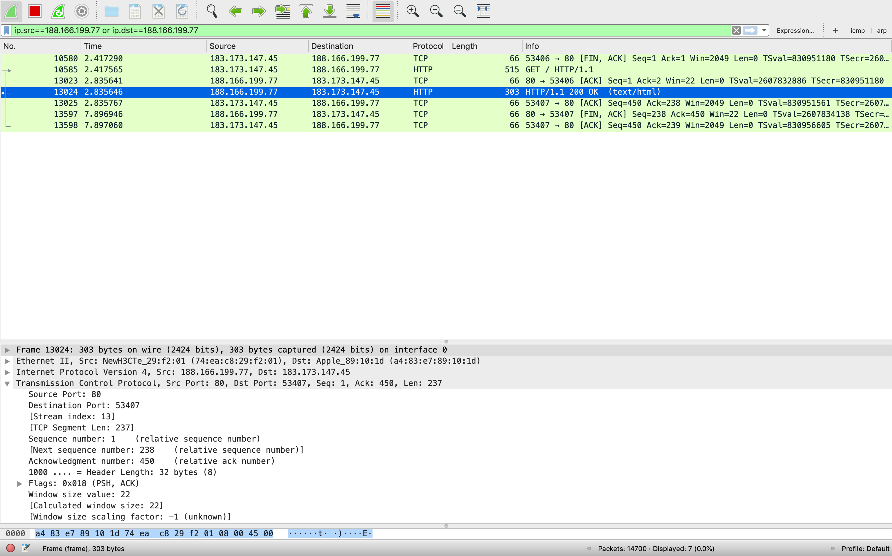
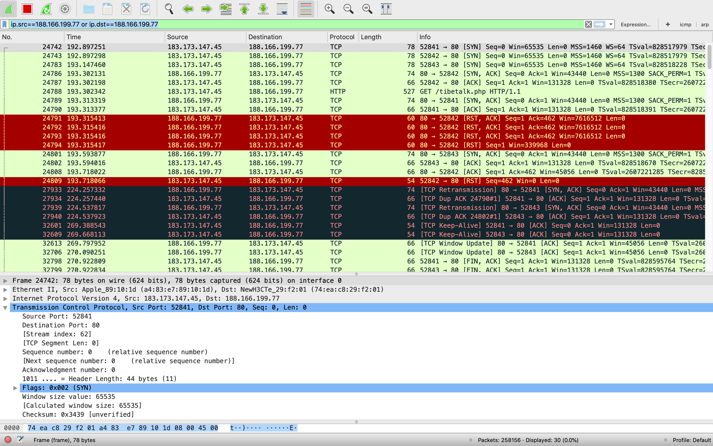
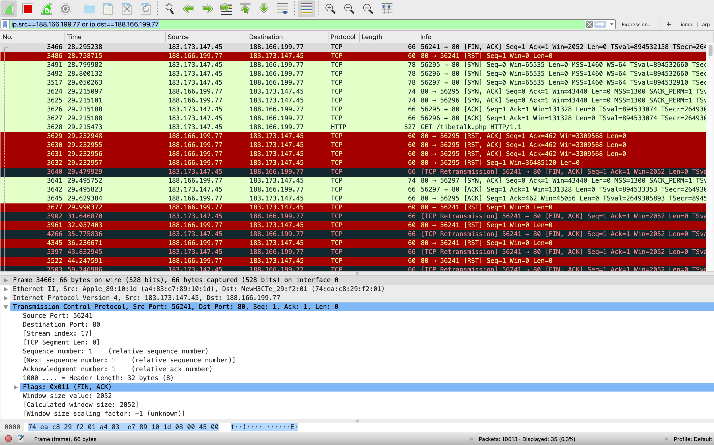
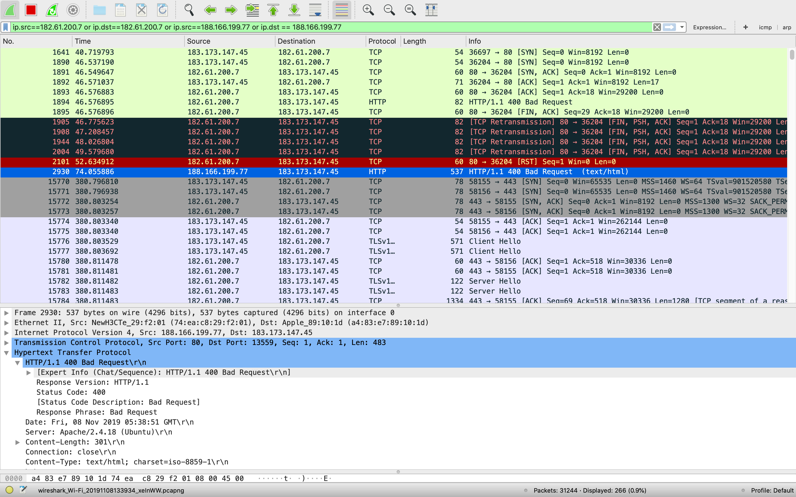
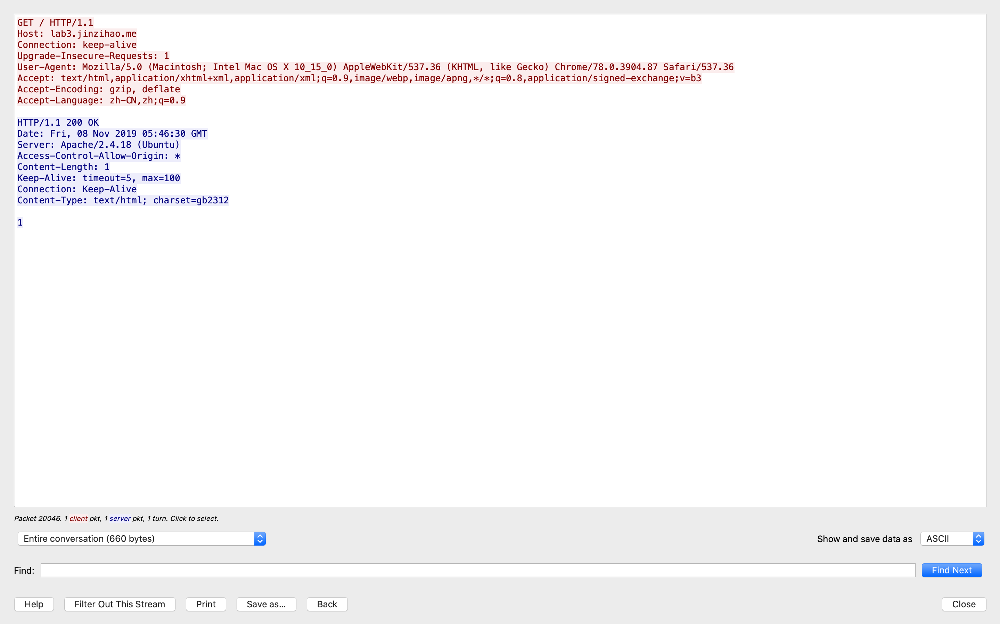
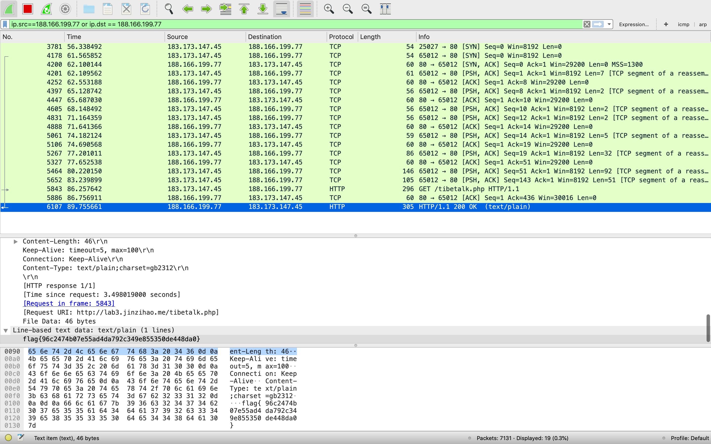

<center>计65 赵鋆峰 2016011373</center>
<center>计65 王展鹏 2016011356</center>
# 实验准备

 - 当我们访问目标网站的[首页](http://lab3.jinzihao.me/)时，wireshark抓包如图：

，同时网页端网站能正常访问。
 - 而当我们访问[目标网站](http://lab3.jinzihao.me/tibetalk.php)时，wireshark抓包如图：
 - ，同时网页端显示连接被重置。
 - 所以我们可以得知：tibetalk为敏感词，被GFW识别之后向客户端发送了TCP RST包来重置连接，客户端接收之后又向目标服务器发送了RST请求。因此，第一个思路就是让客户端忽略所有的TCP RST请求，强行建立连接。

# 忽略TCP RST包

 - 在MacOS上使用PF作为防火墙，配置规则如下
 ```
block in on en0 proto tcp all flags R/RS
block out on en0 proto tcp all flags R/RS
 ```
 - （该规则也避免了在用户层实现TCP握手的时候内核主动发出RST来终止连接的这一行为）
 - 再次访问得到
 - 
 - 可知客户端没有发送RST但服务器仍然向客户端发送了RST报文。这让我们怀疑GFW检测到可疑的访问时会向双方都发送RST，（这一点也在[^1]中得到了证实）如果要用这种方法绕过GFW，必须两边都忽略，而我们只能修改客户端的行为，因此该思路受阻。
[^1]: https://www.cl.cam.ac.uk/~rnc1/ignoring.pdf
 # 分片

 - 首先我们需要能用scapy模拟浏览器发起GET的HTTP请求，当用scapy直接在TCP的payload上写
 ```
GET / HTTP/1.0\n\n
 ```
   时我们会得到如下结果

   

可见浏览器在发送时自动为payload添加了一些其他属性，单单这个payload是不够的的，从浏览器对首页发起一次请求并且用wireshark抓包得到TCP的payload为

 - 
   
   得到访问首页应当发送的payload为
   
   ```
    GET / HTTP/1.1\r\nHost: lab3.jinzihao.me\r\nConnection: keep-alive\r\nUpgrade-Insecure-Requests: 1\r\nUser-Agent: Mozilla/5.0 (Macintosh; Intel Mac OS X 10_15_0) AppleWebKit/537.36 (KHTML, like Gecko) Chrome/78.0.3904.87 Safari/537.36\r\nAccept: text/html,application/xhtml+xml,application/xml;q=0.9,image/webp,image/apng,*/*;q=0.8,application/signed-exchange;v=b3\r\nAccept-Encoding: gzip, deflate\r\nAccept-Language: zh-CN,zh;q=0.9\r\n\r\n
   ```
   所以访问目标网址的payload应当为
   
   ```
    GET /tibetalk.php HTTP/1.1\r\nHost: lab3.jinzihao.me\r\nConnection: keep-alive\r\nUpgrade-Insecure-Requests: 1\r\nUser-Agent: Mozilla/5.0 (Macintosh; Intel Mac OS X 10_15_0) AppleWebKit/537.36 (KHTML, like Gecko) Chrome/78.0.3904.87 Safari/537.36\r\nAccept: text/html,application/xhtml+xml,application/xml;q=0.9,image/webp,image/apng,*/*;q=0.8,application/signed-exchange;v=b3\r\nAccept-Encoding: gzip, deflate\r\nAccept-Language: zh-CN,zh;q=0.9\r\n\r\n
   ```
   
 - 接下来我们需要将payload分片来让每次都不包含会被检测到的敏感词，而连接在一起还与原先的相同。分片方法是在握手后，多次发送ack序号相同，seq序号连续的ack报文。

   尝试了多次分片结果后，我得出了一个能够稳定得到flag的分片方法：
 ```python
  ['GET /ti', 'be', 'ta', 'lk',
   '.php ',
   'HTTP/1.1\r\nHost: lab3.jinzihao.me',
   '\r\nConnection: keep-alive\r\nUpgrade-Insecure-Requests: 1\r\nUser-Agent: Mozilla/5.0 (Macintosh; ',
   'Intel Mac OS X 10_15_0) AppleWebKit/537.36 (KHTML, ',
   'like Gecko) Chrome/78.0.3904.87 Safari/537.36\r\nAccept: text/html,application/xhtml+xml,application/xml;q=0.9,image/webp,image/apng,*/*;q=0.8,application/signed-exchange;v=b3\r\nAccept-Encoding: gzip, deflate\r\nAccept-Language: zh-CN,zh;q=0.9\r\n\r\n']
 ```
  wireshark抓包显示

  
  我们猜测之所以有的分片方法会被GFW gank的原因可能是分片过少、发送时间太快导致IDS能够利用缓存来迅速重组发现敏感词进而发出TCP RST报文，因此把tibetalk被重组起来的时间点拉的越久越不容易被发现。

 - 完整源代码如下：
 ```python
from scapy.layers.inet import *
from scapy.sendrecv import send

if __name__ == '__main__':
    ip = IP(dst='188.166.199.77')
    payloads = ['GET /ti', 'be', 'ta', 'lk',
                '.php ',
                'HTTP/1.1\r\nHost: lab3.jinzihao.me',
                '\r\nConnection: keep-alive\r\nUpgrade-Insecure-Requests: 1\r\nUser-Agent: Mozilla/5.0 (Macintosh; ',
                'Intel Mac OS X 10_15_0) AppleWebKit/537.36 (KHTML, ',
                'like Gecko) Chrome/78.0.3904.87 Safari/537.36\r\nAccept: text/html,application/xhtml+xml,application/xml;q=0.9,image/webp,image/apng,*/*;q=0.8,application/signed-exchange;v=b3\r\nAccept-Encoding: gzip, deflate\r\nAccept-Language: zh-CN,zh;q=0.9\r\n\r\n']
    port = RandNum(1024, 65535)
    SYN = ip / TCP(sport=port, dport=80, flags='S', seq=42)
    ACK = sr1(SYN)
    ack_num = ACK.seq + 1
    send_length = 0
    for p in payloads:
        fragment = ip / TCP(sport=ACK.dport, dport=80, flags='A', seq=ACK.ack + send_length, ack=ack_num) / p
        send(fragment)
        send_length += len(p)
        time.sleep(3)

 ```

​    