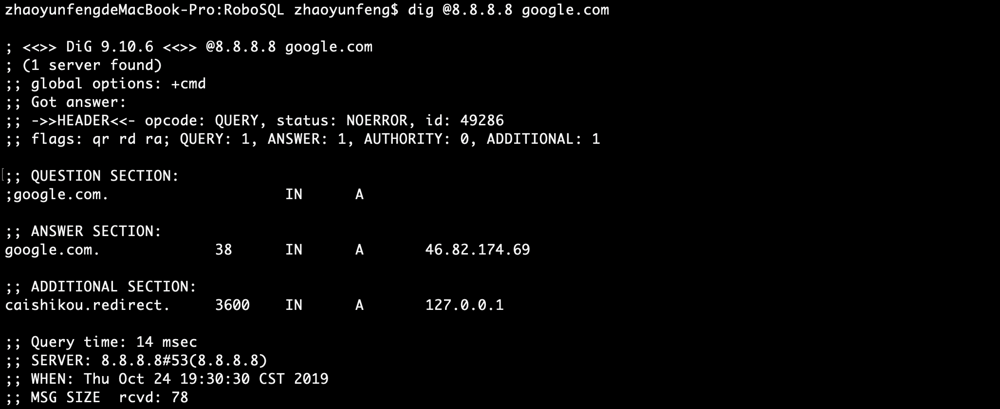
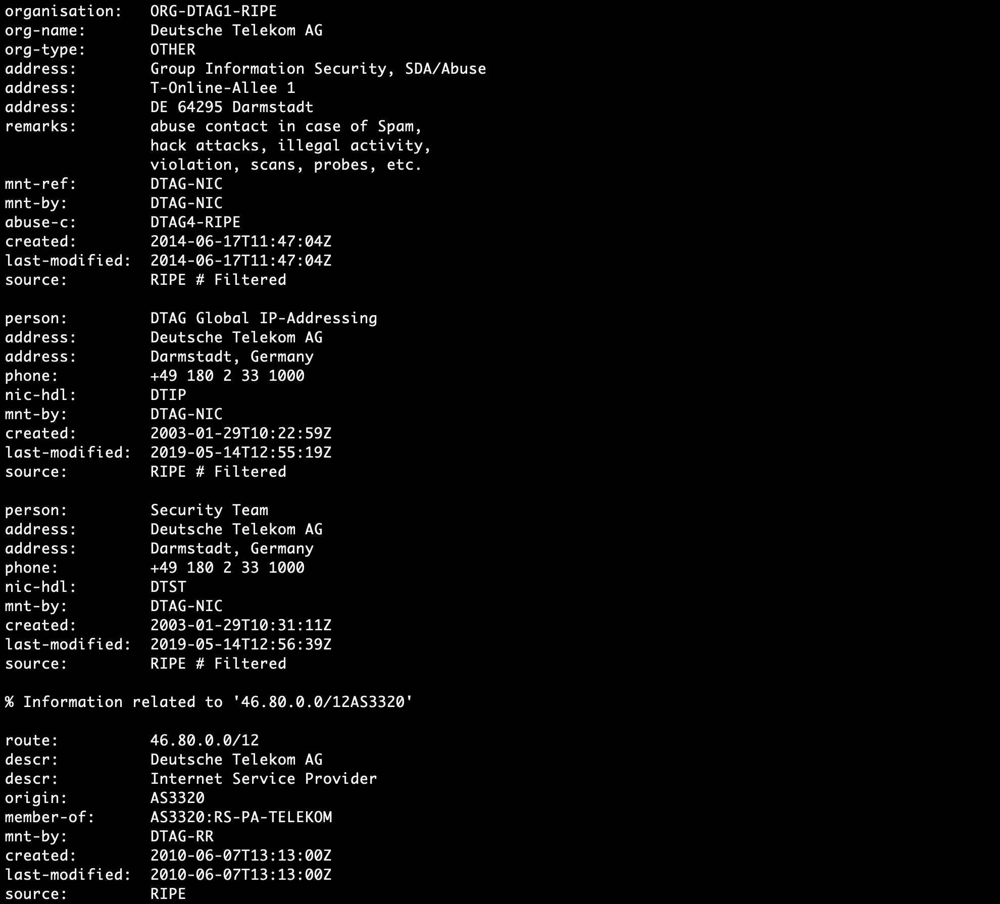
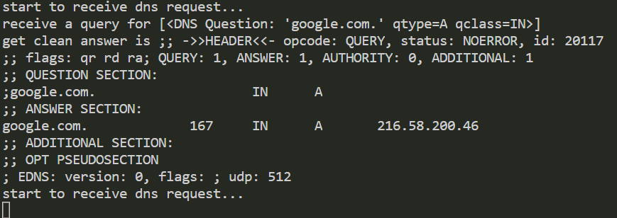
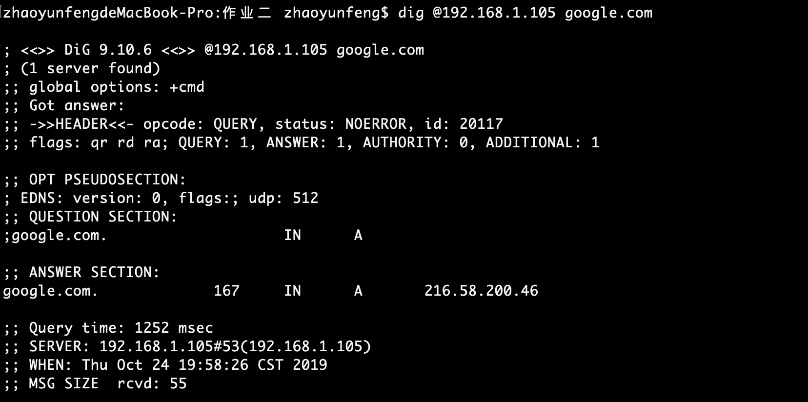
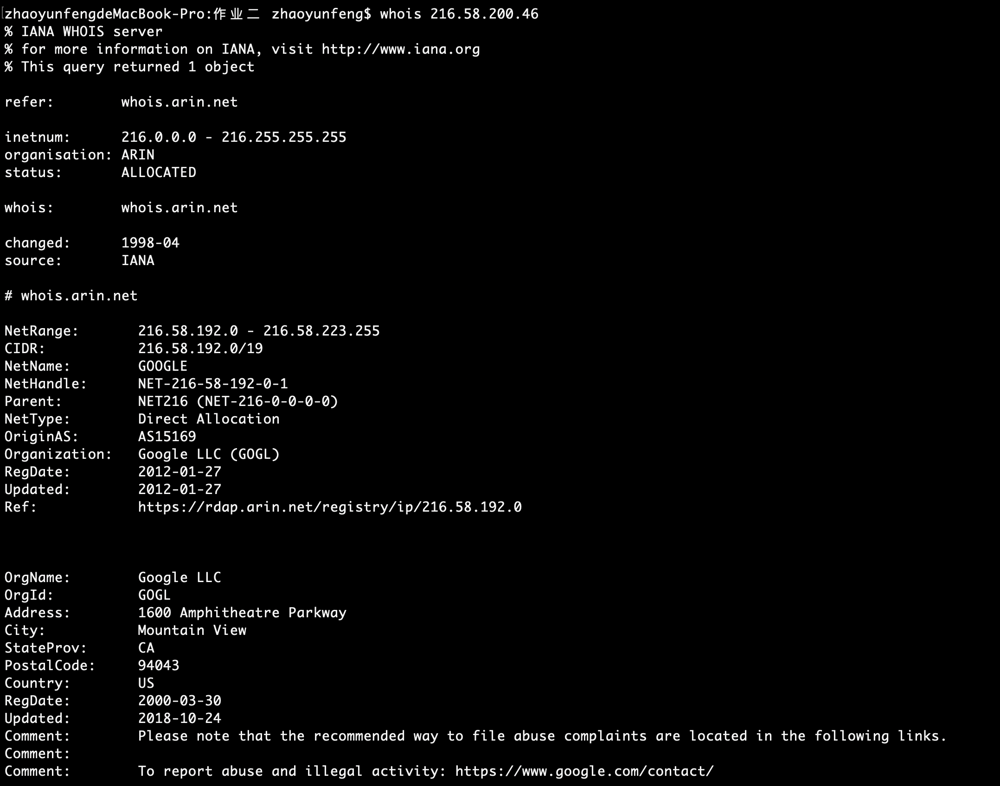

#  GFW使用技术调查

GFW，即Great Firewall，是中国政府用于过滤互联网国际出口上内容的软硬件系统的结合。目前为人所知的GFW所采用的技术主要有以下几种：

#### DNS缓存污染

GFW对所有经过骨干出口路由的在UDP的53端口上的域名查询进行IDS检测，一经发现与黑名单关键词相匹配的域名查询请求，防火长城会马上伪装成目标域名的解析服务器给查询者返回虚假结果。由于通常的域名查询没有任何认证机制，而且域名查询通常基于的UDP协议是无连接不可靠的协议，查询者只能接受最先到达的虚假查询结果，并丢弃之后的正确查询结果。目前大部分的污染手段是解析到固定的无效IP，但曾经使用过解析到随机的境外有效IP的方法，导致了境外服务器遭受了DDoS攻击，部分网站因此屏蔽了中国IP。

#### IP地址或传输层端口封锁

- 针对TCP和UDP连接的封锁
    在早期技术实现中，会使用访问控制列表（ACL）技术来封锁特定的IP地址，由此延伸可以封锁传输层协议（TCP或UDP）的特定目的端口的网络流量。不过由于大量的ACL匹配会导致网络性能不佳，现在主要是采用了效率更高的路由扩散技术封锁特定IP地址。

- 针对UDP连接的干扰
  针对使用UDP连接的网站，在保证IP未被路由扩散技术封锁的情况下，使用HTTP/3（QUIC传输协议）的UDP连接可以有效避开防火长城的审查。但从2019年3月起，出现针对UDP的连接干扰，使得目前所有利用UDP翻墙的手段都可能会受到干扰。

#### TCP连接重置

针对TCP连接，GFW可以比连接双方更快地发送连接重置消息，使连接双方认为对方终止了连接而自行关闭连接，其效率被认为比单纯的数据包丢弃更有效，因为后者会令连接双方认为连接超时而不断重试建立连接。这种方法需要结合相应的检测方式来实施，包括针对HTTP协议的关键字阻断、针对TLS的证书传输检测、针对TLS的SNI阻断、对eD2k协议的连接干扰等等。

# 被墙域名测试

- 从网上下载得到100万个最常用的域名，因速度原因选择了最前面的5000个进行测试。运行fping.py进行批量ping测试，并将结果输出到results.txt中。结果成功解析域名4668个，可ping通2912个，可知剩余1756个网站被墙。

# 无污染DNS服务器搭建

- 我们采用的是老师课上介绍的方法的简化版：
~~~
	因为DNS劫持导致的假的reply通常会以极快的速度返回并被接受，因此我们做法为发出请求后端口保持一段时间（程序中写死为固定值），将接收到的最后一个reply认为是正确的结果并且发回给请求方。
~~~

- 具体实现中，我们使用了dnslib库来发DNS请求包和解析DNS回复包，使用dnspython库来调用正常的dns服务来对获取的域名到ip的映射进行对比，结果写在了domains2ips.csv中。
- 最后我们用两台电脑做了实验，电脑A运行我们的dns服务器并且监听53端口，同时用电脑B对A用dig发起其他域名的请求，对收到的DNS请求包转发给8.8.8.8的53端口并且用1秒内的最后一个返回结果作为真正的返回结果返回给请求方。实验结果如下：
  - 未开启服务时B请求解析google.com得到结果
  - 调用whois查询ip所属得到结果如图，可知其并不是google真正的ip
  - A开启dns_service.py服务后，再次用dig请求对google.com域名进行解析，服务器(A)端输出如图
  - 得到
  - 再次调用whois查询得到结果，可知这确实是google.com真正的ip之一
  - 可见DNS服务器获得了正确的无污染的结果