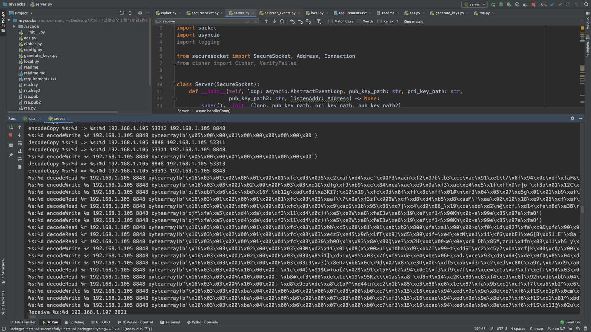

# 安全的代理

王展鹏 2016011356
赵鋆峰 2016011373

## 加密方法：
借助python的pycrypto库，使用公/私钥RSA加密和AES对称会话密钥加密，使用RSA算法进行签名。

### 具体实现：
事先生成好两对RSA公钥和密钥，分别保存在客户端和服务端本地，AES会话密钥由双方沟通确定。定义`AESUtil`类和`RsaUtil`类，用来保存各自的密钥和执行加密操作。对于要加密的`bytes`流，先用SHA256取出摘要，然后使用本地的RSA私钥进行签名，把签名后的结果接在`bytes`流后面。再对整体使用远端的公钥进行Rsa加密，对得到的结果再使用会话密钥进行AES加密后发出。对于要解密的`bytes`流，先用会话密钥进行第一次解密，再用本地的RSA私钥进行第二次解密，由于签名的长度是确定的，可以确定得到的结果的后128位是签名，前面的部分是传输内容。然后使用远端的公钥验签，认证不成功则报错。如上的签名过程可以确保数据的完整性。

RSA加密要求明文长度不能超过某个特定值，解决办法是定义`public_long_encrypt`函数，将待加密数据分段后分别加密再接到一起，解密同理分段进行。这里需要注意的是明文和密文的长度关系，分段的时候长度必须对应。

AES加密要求明文长度必须是{16, 24, 32}之一的倍数。本项目中以16为基数。对于长度不满足条件的串，用`padding`字符补足到只差一位，再在最后一位记录补足的个数。对于长度是16的整数倍的串，补上15个`padding`字符后再最后一位记录好16。解密时读出最后一位的数字，把后面对应的位抛弃掉即可。

## 网络设计：
使用了开源项目Lightsocks的Python版本[Lightsocks-Python](https://github.com/linw1995/lightsocks-python)中网络框架的部分。客户端和服务端使用SOCKS5代理协议通信，传输的密文包在本地解密。

## 实验结果：
从控制台输出可以看出，双方进行了大量的数据交换。但在Chrome浏览器中配置好代理设置后，只能很不稳定地加载出网页内容。其中对于微博网页[weibo.com](weibo.com)，浏览器可以比较稳定地加载出网站证书，但不能显示网页内容。加密算法经本地测试并无错误，但我们没能找到网页不能稳定显示的原因。

客户端控制台输出示例：

服务端控制台输出示例：
